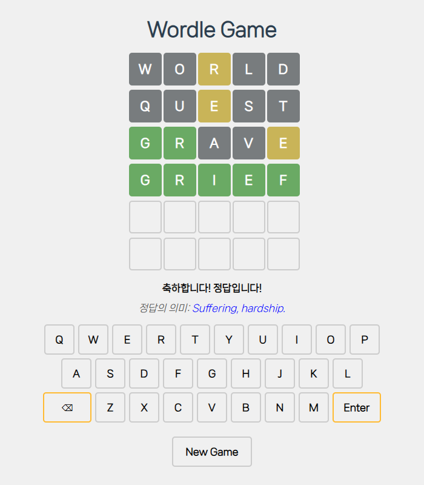

# English Game: Wordle

이 프로젝트는 단어 추측 게임 **Wordle**을 간단하게 구현한 웹 서비스입니다.

## 프로젝트 개요

**Wordle**은 주어진 6번의 기회를 통해 특정 글자 수의 단어를 추측하는 게임입니다. 각 추측에 대해 단어의 위치와 정확성을 색상으로 피드백하여 사용자가 올바른 단어를 맞힐 수 있게끔 합니다. 이 프로젝트는 Wordle의 기본 규칙을 따르며, 라운드가 종료되면 정답 단어와 사전적 의미를 함께 제공함으로써 교육적 효과를 기대할 수 있습니다.

## 규칙

- 무작위로 선택된 5글자의 영단어를 6번의 기회 안에 추측해야 합니다.

- 추측한 단어의 정확성을 글자마다 색상으로 표시:
  - **녹색**: 글자와 위치가 모두 정확합니다.
  - **황색**: 단어에 포함되지만 위치가 다른 글자입니다.
  - **회색**: 단어에 포함되지 않는 글자입니다.

    

## 실행 방법

이 프로젝트를 로컬에서 실행하거나, GitHub Pages를 통해 웹 브라우저에서 바로 플레이할 수 있습니다.
   
- [GitHub Pages에서 바로 실행하기](https://1st-world.github.io/English-Game/)

- 로컬에서 실행하기
    - 이 저장소를 클론하거나 다운로드합니다.
    - `index.html` 파일을 웹 브라우저에서 열어 게임을 시작할 수 있습니다.
    - 단, 외부 API를 불러오기 위해 인터넷이 연결되어 있어야 합니다.

## 외부 API

- **무작위 단어 선택 기능**: [Random Word Generator API](https://random-word-api.vercel.app/) 사용

- **단어 의미 검색 기능**: [Free Dictionary API](https://dictionaryapi.dev/) 사용
